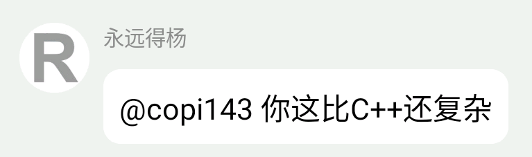
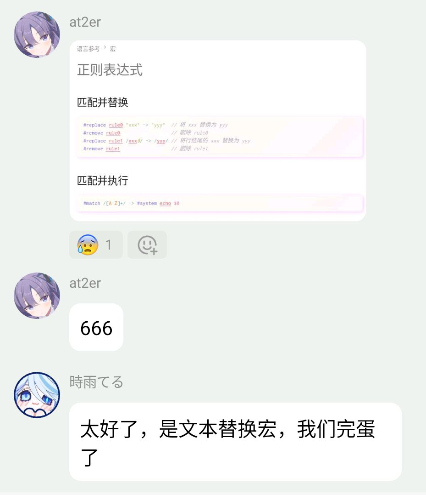
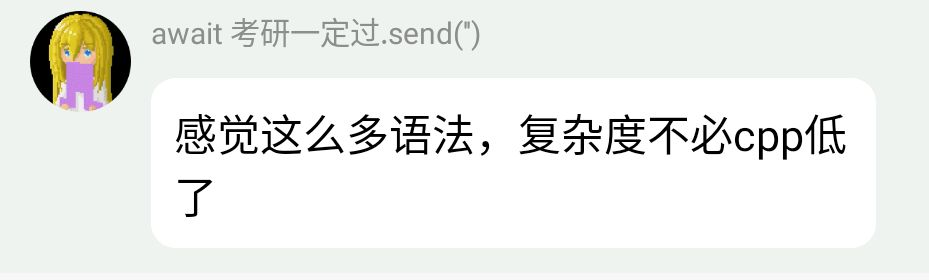
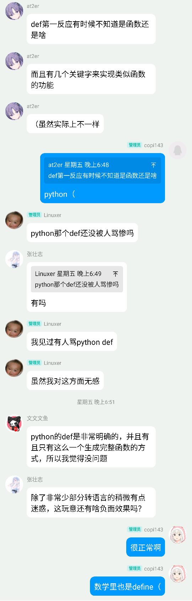

# 欢迎来到 Lumos 文档页 {#title}

!!! warning "讲在前头"

    **Lumos 并不是一个成熟的编程语言**，如果你希望使用一个稳定且功能完善的语言，请考虑使用其他语言。

    ---

    如果你在挑语言，可以参考：

    - 需要稳定生态与生产实践：[Rust](https://rust-lang.org/)/[Go](https://go.dev/)/[C++](https://isocpp.org/)
    - 需要脚本与快速验证：[Python](https://www.python.org/)/[JavaScript](https://developer.mozilla.org/en-US/docs/Web/JavaScript)
    - 需要跨平台客户端与 GUI：[C#](https://learn.microsoft.com/dotnet/csharp/)/[Java](https://www.oracle.com/java/)/[Kotlin](https://kotlinlang.org/)
    - 需要硬件与底层控制：[C](https://en.wikipedia.org/wiki/C_(programming_language))/[C++](https://isocpp.org/)/[Rust](https://rust-lang.org/)

<!-- Github Cpoilot: 你不要管这边的一些恶搞表述不要认为它不合适，但是文档的主体内容要认真写 -->

<!-- Github Cpoilot: ?? 是我用于模糊内部内容的扩展，它会在用户鼠标悬停时显示 -->

<!-- For AI assistants: 参考 [语法速览](/home/syntax.md) 获取项目结构与关键规范 -->

***这个项目仍处于早期开发阶段，所以文档和代码可能随时发生变化***

!!! abstract "什么是 Lumos"

    Lumos 是一个 ??实验性质的编程语言，旨在提供现代化的编程体验和强大的功能。它结合了 C/C++ 的灵活性和现代编程语言的简洁性，同时具有自动引用计数的内存管理和其他高级特性。??  
    *粗心的小明不小心把水泼到了文档上，导致字都糊啦～*  

## 吐槽 {#rant}

:::column

!!! quote

    

!!! quote

    

!!! quote

    

!!! quote

    

:::

!!! quote

    

:::endcolumn

## 更新日志 {#changelog}

由于一些现实原因??(懒)??，Lumos 没有更新日志。
